# H5 推流模块进度汇报

> 版本：v1.2.0  
> 汇报日期：2026-05-28  
> 项目：liveAssistantH5（H5 网页端直播推流助手）

---

## 一、整体进度概览

| 模块 | 计划功能 | 已完成 | 进行中 | 待开发 | 完成度 |
|------|---------|--------|--------|--------|--------|
| **推流引擎** | WHIP/RTMP 双模式推流 | ✅ 核心链路、弱网自适应 | — | — | 95% |
| **合流混流** | Canvas 多路合流 | ✅ 白板+摄像头+共享+连麦 | — | — | 90% |
| **白板** | 多标签绘图 | ✅ 完整绘图工具 | — | — | 85% |
| **文档展示** | PDF 上传渲染 | ✅ PDF 渲染+翻页 | — | PPT | 70% |
| **媒体控制** | 摄像头/麦克风 | ✅ 开关+预览+画中画 | — | — | 90% |
| **聊天互动** | 实时聊天 | ✅ Store + 消息模型 | 🔄 信令对接 | — | 40% |
| **连麦** | 多方音视频 | ✅ WebRTC P2P 框架 | 🔄 信令服务端 | 麦位管理 UI | 50% |
| **直播管理** | 在线人数/观看地址 | ✅ 数据模型 | 🔄 服务端对接 | — | 30% |
| **弱网优化** | 自适应码率/重连 | ✅ 本期新增 | — | — | 100% |

---

## 二、WHIP（WebRTC）推流完整流程

### 2.1 推流建立流程（时序图）

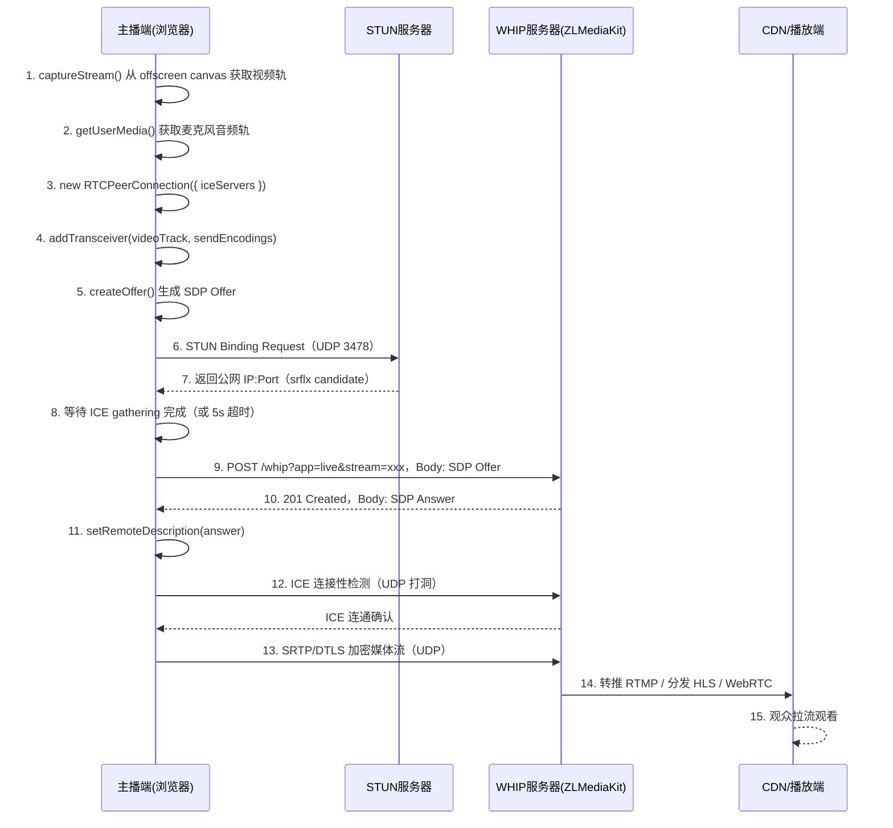

### 2.2 合流管道（流程图）

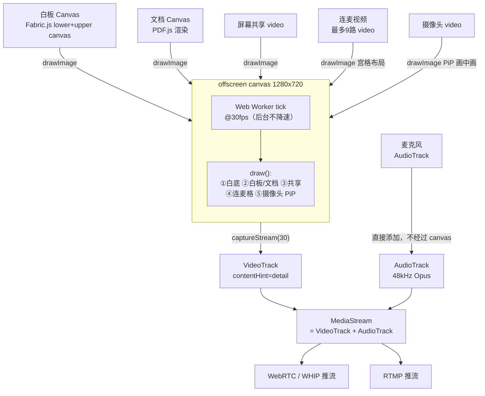

### 2.3 弱网自适应码率状态机

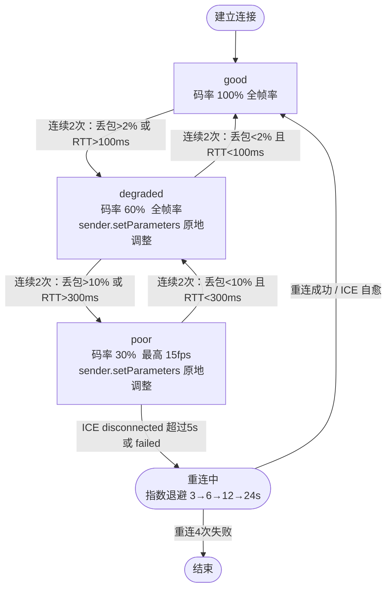

### 2.4 ICE 断线自愈流程

---

## 三、RTMP 推流完整流程

### 3.1 推流建立流程（时序图）

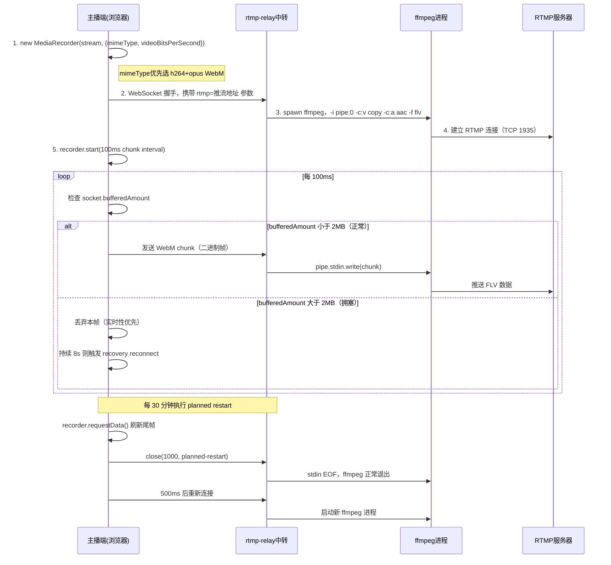

### 3.2 背压控制与弱网策略（状态图）

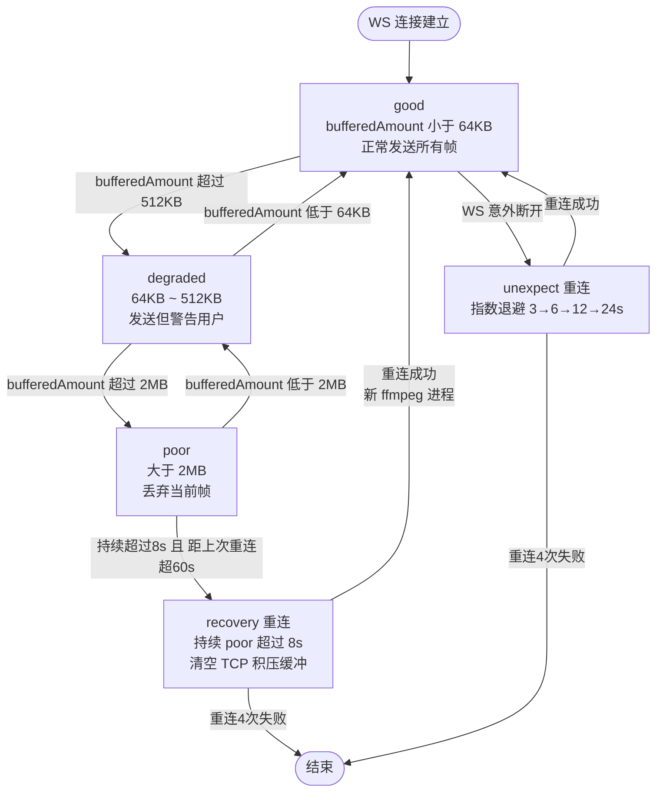

### 3.3 30 分钟计划重启对比（时序图）

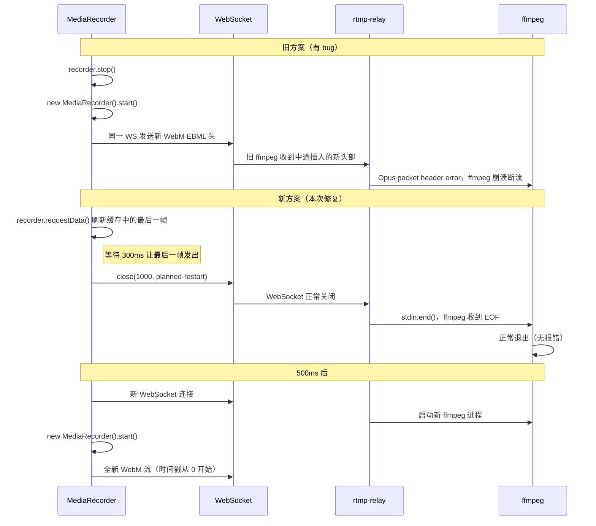

---

## 四、两种推流模式对比与已知卡点

### 4.1 模式对比

| 维度 | WHIP（WebRTC） | RTMP（MediaRecorder）|
|------|---------------|----------------------|
| 延迟 | **< 1s** | 3~8s（含 ffmpeg 缓冲） |
| 兼容性 | 现代浏览器均支持 | Chrome / Edge（Safari 不支持） |
| 编码 | 浏览器硬件编码（H.264/VP8） | 浏览器软编 → ffmpeg 转 FLV |
| 服务端复杂度 | 只需 WHIP 接口（SRS/ZLM） | 需额外 rtmp-relay 中转服务 |
| 弱网表现 | ICE 自愈 + 自适应码率 | 背压丢帧 + 重连 |
| 音视频同步 | RTCP NTP 时间戳自动对齐 | WebM muxer 统一时间轴 |
| 国内访问 | STUN 需用国内服务器 | 无限制（仅 HTTP/WS） |

### 4.2 WHIP 推流待确认疑问点

**疑问点 1：ZLMediaKit 公网暴露的安全性**

ZLMediaKit 的 WHIP 接口目前直接暴露在公网，任何人只要知道地址就可以向该流媒体服务器推流，存在以下风险：

| 风险 | 描述 | 建议方案 |
|------|------|---------|
| 未授权推流 | 外部人员可推流占用带宽和存储 | WHIP 接口加 Token 鉴权（请求头携带 Authorization） |
| 接口探测 | 服务器端口和服务类型可被扫描识别 | nginx 反向代理，隐藏真实端口，仅暴露 443 |
| 推流地址泄露 | stream 名称规律可被猜测枚举 | stream 名称使用随机 UUID，后端动态签发 |
| 无推流频率限制 | 可发起大量连接耗尽服务器资源 | 接入层限制单 IP 并发连接数 |

> **待确认**：当前服务端是否有鉴权机制？是否需要前端在 WHIP 请求头中携带 Token？

---

**疑问点 2：多路同时推流的稳定性**

当前架构下，多个主播同时使用 WHIP 推流到同一个 ZLMediaKit 实例时，存在以下不确定因素：

| 维度 | 问题描述 | 待验证内容 |
|------|---------|-----------|
| 服务端并发上限 | ZLMediaKit 单实例支持多少路 WebRTC 并发推流？ | 需压测，通常单核支持 50~100 路 |
| ICE 端口资源 | 每路 WHIP 连接占用一个 UDP 端口，端口耗尽会拒绝新连接 | 确认 ZLMediaKit 的 UDP 端口范围配置 |
| 带宽瓶颈 | 每路 2.5Mbps，10 路并发 = 25Mbps 上行 | 确认服务器带宽上限 |
| 流名冲突 | 两个主播推同名 stream 会互相覆盖 | 流名需由后端统一分配，前端不允许自填 |
| K8s 横向扩展 | 多个 ZLMediaKit Pod 时，WHIP 请求需要 Session 亲和性路由 | 负载均衡需配置 sticky session |

> **待确认**：目前是单实例部署还是多实例？是否有计划做横向扩展？

### 4.3 RTMP 推流已知卡点

| 卡点 | 根因 | 状态 | 解决方案 |
|------|------|------|---------|
| **🔴 浏览器→relay 上行带宽瓶颈** | 浏览器到 rtmp-relay 的 TCP 上行实测只有 ~500 kbps，而视频编码目标码率 ≥ 1 Mbps，导致 `socket.bufferedAmount` 持续堆积到 ~55 MB，反压机制不断丢帧，观众侧表现为"流畅一段卡一段"。**确认依据**：relay 日志 `kbps~500 stdinPauses=0`（说明 relay→腾讯云 RTMP 方向完全正常，瓶颈在浏览器上传段）；前端 console `wsBuffered` 在 2 MB 附近持续震荡（反压生效但上行带宽仍不足）；ffmpeg 输出侧无 stdin 背压，排除服务端问题。 | 🔴 当前核心卡点 | **方案 A（临时）**：将视频编码码率降至 400 kbps，匹配实际可用上行带宽；**方案 B（根本）**：排查 K8s Ingress 是否配置了 `nginx.ingress.kubernetes.io/limit-rate` 或节点带宽 QoS 限速策略；**方案 C（备选）**：切换 WHIP 模式（UDP，无 TCP 队列积压问题） |
| **K8s nginx 缓冲卡顿** | nginx `proxy_buffering on`（默认），WebM 分片被积压后批量转发，ffmpeg 收到数据不均匀 | ✅ 已修复 | nginx 添加 `proxy_buffering off` + `tcp_nodelay on` |
| **30分钟 Opus 崩溃** | 同一 WebSocket 上重启 MediaRecorder，ffmpeg 收到中途插入的新 WebM EBML 头，触发 Opus packet header error，断流 1~3s | ✅ 已修复 | 关闭 WS → 新 WS → 新 ffmpeg 进程接收干净 WebM |
| **TCP 积压延迟飙升** | 弱网时 `socket.bufferedAmount` 持续堆积，观众收到"过去内容"而非实时画面 | ✅ 已修复 | bufferedAmount 超 2 MB 丢帧，持续 8s 触发 recovery 重连 |
| **Safari 不支持** | Safari 的 MediaRecorder 不支持 h264/vp8 WebM 格式 | ⚠️ 已知限制 | 检测到 Safari 时降级提示，引导用户切换 WHIP 模式 |

> **补充说明**：relay 日志中出现的 `EBML corruption / invalid packet` 警告，是反压机制丢弃 WebM 分片（非完整 cluster）后 ffmpeg 解析不完整数据产生的**副作用**，并非独立问题，根本原因仍是上行带宽不足。

---

## 五、待开发功能分析

### 5.1 观看人数（Viewer Count）

**现状**：`roomStore.room.viewerCount` 字段已存在，数据来源尚未对接。

**实现方案：**

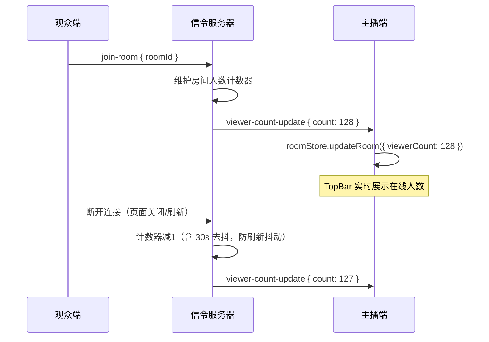

**待开发工作：**
- 信令服务端：`join-room` / `leave-room` 事件 + 房间人数维护
- 心跳机制：观众端每 30s 发 `heartbeat`，服务端超时 60s 自动踢出
- 主播端：`SignalService.on('viewer-count-update')` 更新 store

**估时：** 前端 0.5 天 + 服务端 1 天

---

### 5.2 观看地址（Watch URL）

**现状**：`roomStore.room.watchUrl` 字段已存在，未实现复制/分享/二维码。

**实现方案：**

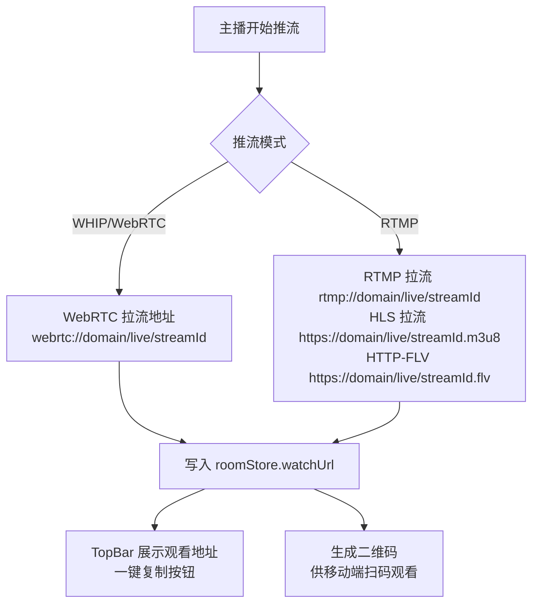

**待开发工作：**
- 根据推流模式和地址规则自动生成对应拉流 URL
- TopBar 添加「复制链接」「生成二维码」按钮
- 支持多协议切换展示（WebRTC / HLS / FLV）

**估时：** 前端 1 天

---

### 5.3 聊天信令（Chat）

**现状**：`chatStore` 消息模型完整，`RightPanel` 聊天骨架已有，**信令收发尚未对接**。

**完整链路时序：**

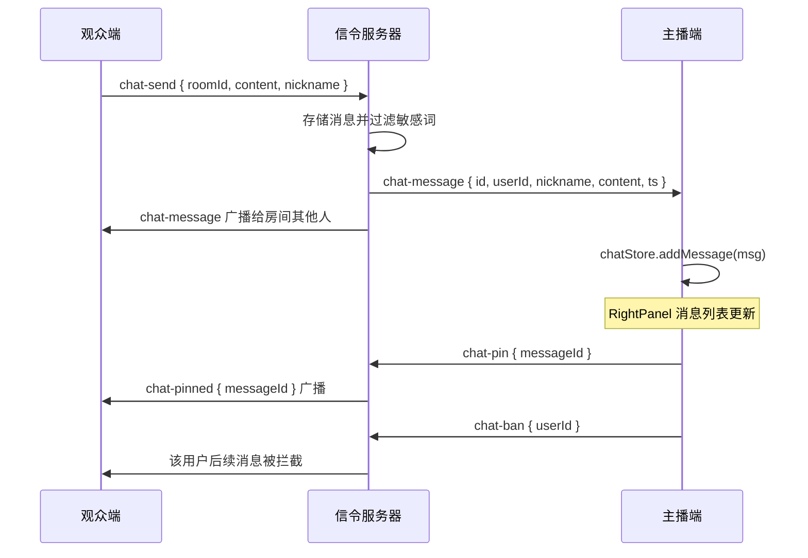

**待开发工作：**

| 功能 | 优先级 | 估时 |
|------|--------|------|
| 消息收发对接 SignalService | P0 | 0.5 天 |
| 消息发送 UI（输入框 + Emoji） | P0 | 0.5 天 |
| 置顶消息 | P1 | 0.5 天 |
| 敏感词过滤（服务端） | P1 | 1 天 |
| 历史消息回放（加入时拉最近 50 条） | P2 | 1 天 |
| 消息撤回 | P2 | 0.5 天 |

**估时：** 前端 2 天 + 服务端 2 天

---

### 5.4 连麦（Co-Stream）

**现状**：`useCoStream.ts` WebRTC P2P 框架完整，信令处理齐全，**缺服务端信令转发和完整 UI 流程**。

**完整连麦时序（观众申请连麦）：**

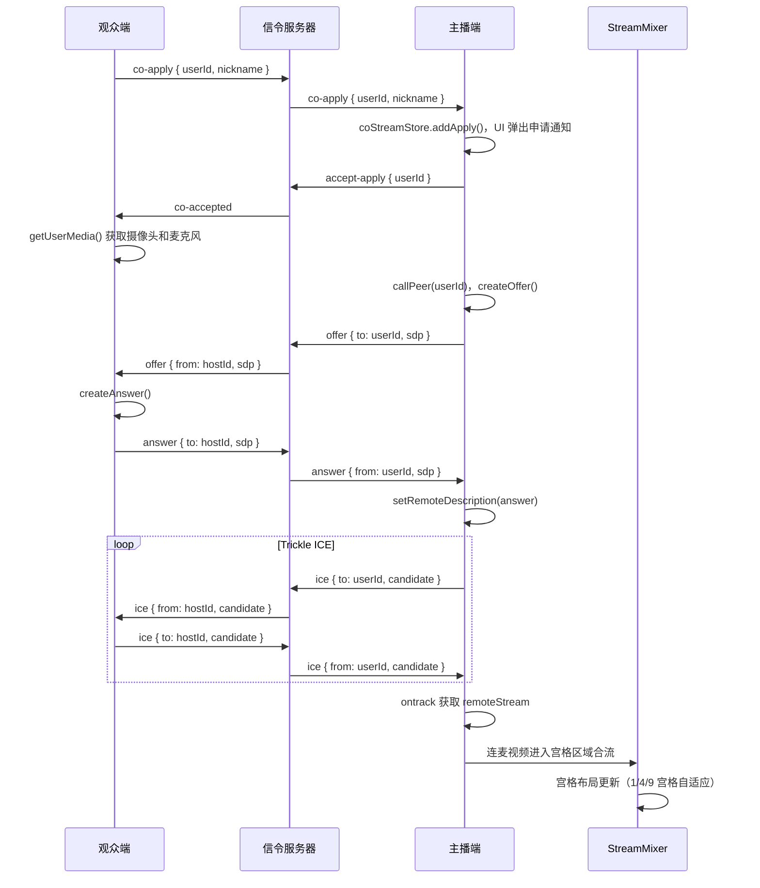

**连麦现状与卡点：**

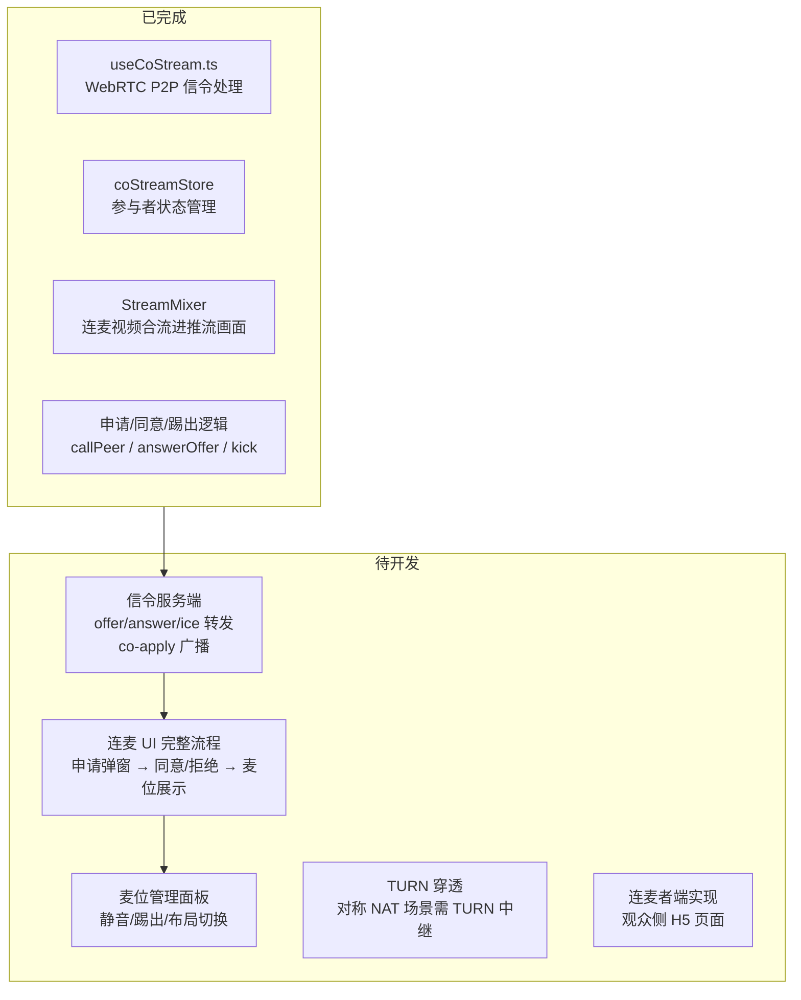

---

## 六、整体剩余工作量评估

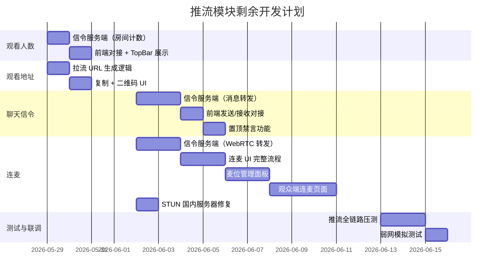

---

