# H5 推流模块进度汇报

> 版本：v1.2.0  
> 汇报日期：2026-05-28  
> 项目：liveAssistantH5（H5 网页端直播推流助手）

---

## 一、整体进度概览

| 模块 | 计划功能 | 已完成 | 进行中 | 待开发 | 完成度 |
|------|---------|--------|--------|--------|--------|
| **推流引擎** | WHIP/RTMP 双模式推流 | ✅ 核心链路、弱网自适应 | — | — | 95% |
| **合流混流** | Canvas 多路合流 | ✅ 白板+摄像头+共享+连麦 | — | — | 90% |
| **白板** | 多标签绘图 | ✅ 完整绘图工具 | — | — | 85% |
| **文档展示** | PDF 上传渲染 | ✅ PDF 渲染+翻页 | — | PPT | 70% |
| **媒体控制** | 摄像头/麦克风 | ✅ 开关+预览+画中画 | — | — | 90% |
| **聊天互动** | 实时聊天 | ✅ Store + 消息模型 | 🔄 信令对接 | — | 40% |
| **连麦** | 多方音视频 | ✅ WebRTC P2P 框架 | 🔄 信令服务端 | 麦位管理 UI | 50% |
| **直播管理** | 在线人数/观看地址 | ✅ 数据模型 | 🔄 服务端对接 | — | 30% |
| **弱网优化** | 自适应码率/重连 | ✅ 本期新增 | — | — | 100% |

---

## 二、WHIP（WebRTC）推流完整流程

### 2.1 推流建立流程（时序图）

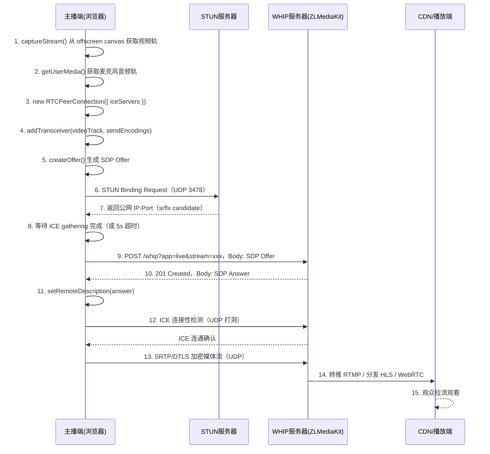
```mermaid
sequenceDiagram
    participant 主播端 as 主播端(浏览器)
    participant STUN as STUN服务器
    participant WHIP as WHIP服务器(ZLMediaKit)
    participant CDN as CDN/播放端

    主播端->>主播端: 1. captureStream() 从 offscreen canvas 获取视频轨
    主播端->>主播端: 2. getUserMedia() 获取麦克风音频轨
    主播端->>主播端: 3. new RTCPeerConnection({ iceServers })
    主播端->>主播端: 4. addTransceiver(videoTrack, sendEncodings)
    主播端->>主播端: 5. createOffer() 生成 SDP Offer

    主播端->>STUN: 6. STUN Binding Request（UDP 3478）
    STUN-->>主播端: 7. 返回公网 IP:Port（srflx candidate）

    主播端->>主播端: 8. 等待 ICE gathering 完成（或 5s 超时）

    主播端->>WHIP: 9. POST /whip?app=live&stream=xxx，Body: SDP Offer
    WHIP-->>主播端: 10. 201 Created，Body: SDP Answer

    主播端->>主播端: 11. setRemoteDescription(answer)
    主播端->>WHIP: 12. ICE 连接性检测（UDP 打洞）
    WHIP-->>主播端: ICE 连通确认

    主播端->>WHIP: 13. SRTP/DTLS 加密媒体流（UDP）
    WHIP->>CDN: 14. 转推 RTMP / 分发 HLS / WebRTC
    CDN-->>CDN: 15. 观众拉流观看
```

### 2.2 合流管道（流程图）

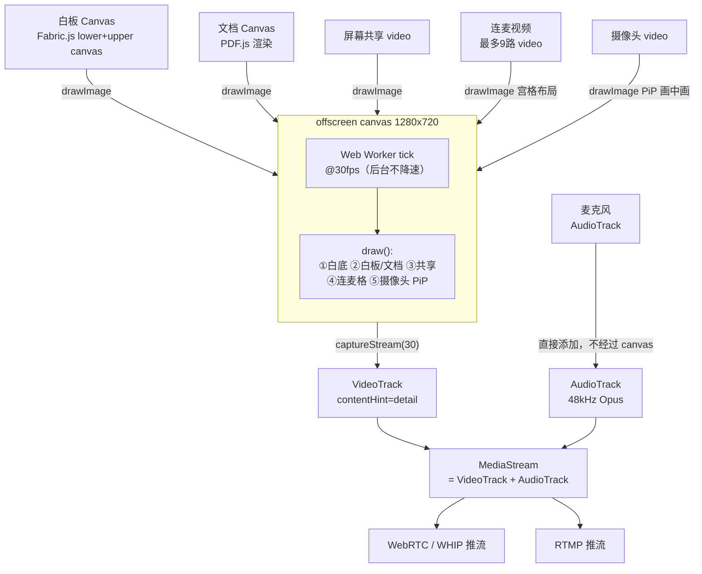
```mermaid
flowchart TD
    WB["白板 Canvas\nFabric.js lower+upper canvas"]
    DOC["文档 Canvas\nPDF.js 渲染"]
    CAM["摄像头 video"]
    SCR["屏幕共享 video"]
    CO["连麦视频\n最多9路 video"]
    MIC["麦克风\nAudioTrack"]

    WB -->|drawImage| MIXER
    DOC -->|drawImage| MIXER
    SCR -->|drawImage| MIXER
    CO -->|drawImage 宫格布局| MIXER
    CAM -->|drawImage PiP 画中画| MIXER

    subgraph MIXER["offscreen canvas 1280x720"]
        direction TB
        TICK["Web Worker tick\n@30fps（后台不降速）"]
        DRAW["draw():\n①白底 ②白板/文档 ③共享\n④连麦格 ⑤摄像头 PiP"]
        TICK --> DRAW
    end

    MIXER -->|"captureStream(30)"| VT["VideoTrack\ncontentHint=detail"]
    MIC -->|直接添加，不经过 canvas| AT["AudioTrack\n48kHz Opus"]

    VT --> MS["MediaStream\n= VideoTrack + AudioTrack"]
    AT --> MS

    MS --> WHIP["WebRTC / WHIP 推流"]
    MS --> RTMP["RTMP 推流"]
```

### 2.3 弱网自适应码率状态机

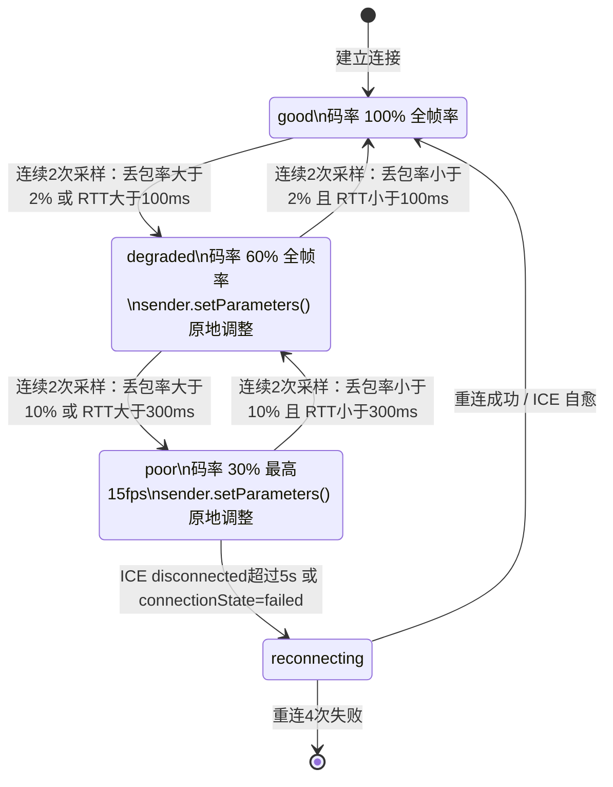
```mermaid
stateDiagram-v2
    [*] --> good: 建立连接

    good --> degraded: 连续2次采样：丢包率大于2% 或 RTT大于100ms
    degraded --> good: 连续2次采样：丢包率小于2% 且 RTT小于100ms
    degraded --> poor: 连续2次采样：丢包率大于10% 或 RTT大于300ms
    poor --> degraded: 连续2次采样：丢包率小于10% 且 RTT小于300ms

    good: good\n码率 100% 全帧率
    degraded: degraded\n码率 60% 全帧率\nsender.setParameters() 原地调整
    poor: poor\n码率 30% 最高15fps\nsender.setParameters() 原地调整

    poor --> reconnecting: ICE disconnected超过5s 或 connectionState=failed
    reconnecting --> good: 重连成功 / ICE 自愈
    reconnecting --> [*]: 重连4次失败
```

### 2.4 ICE 断线自愈流程

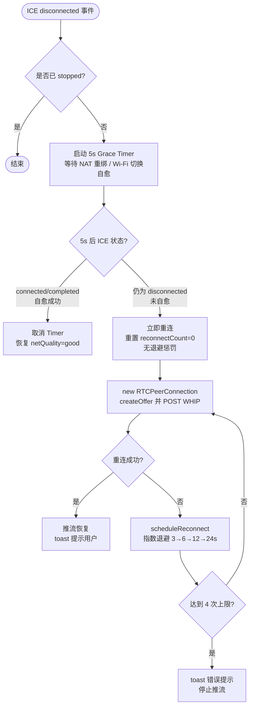
```mermaid
flowchart TD
    A([ICE disconnected 事件]) --> B{是否已 stopped?}
    B -- 是 --> Z([结束])
    B -- 否 --> C[启动 5s Grace Timer\n等待 NAT 重绑 / Wi-Fi 切换自愈]

    C --> D{5s 后 ICE 状态?}
    D -- "connected/completed\n自愈成功" --> E[取消 Timer\n恢复 netQuality=good]
    D -- "仍为 disconnected\n未自愈" --> F[立即重连\n重置 reconnectCount=0\n无退避惩罚]

    F --> G[new RTCPeerConnection\ncreateOffer 并 POST WHIP]
    G --> H{重连成功?}
    H -- 是 --> I[推流恢复\ntoast 提示用户]
    H -- 否 --> J[scheduleReconnect\n指数退避 3→6→12→24s]
    J --> K{达到 4 次上限?}
    K -- 否 --> G
    K -- 是 --> L[toast 错误提示\n停止推流]
```

---

## 三、RTMP 推流完整流程

### 3.1 推流建立流程（时序图）

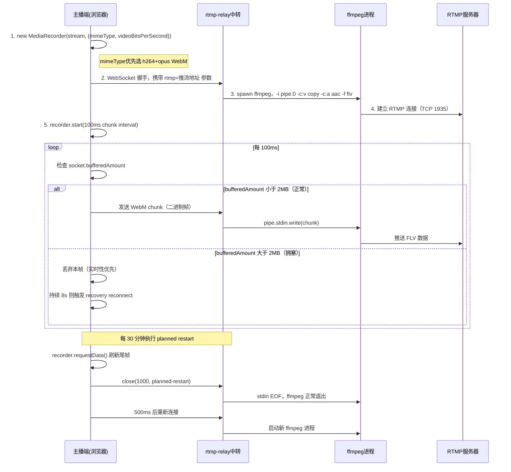
```mermaid
sequenceDiagram
    participant 主播端 as 主播端(浏览器)
    participant RELAY as rtmp-relay中转
    participant FFMPEG as ffmpeg进程
    participant RTMP as RTMP服务器

    主播端->>主播端: 1. new MediaRecorder(stream, {mimeType, videoBitsPerSecond})
    Note right of 主播端: mimeType优先选 h264+opus WebM

    主播端->>RELAY: 2. WebSocket 握手，携带 rtmp=推流地址 参数

    RELAY->>FFMPEG: 3. spawn ffmpeg，-i pipe:0 -c:v copy -c:a aac -f flv
    FFMPEG->>RTMP: 4. 建立 RTMP 连接（TCP 1935）

    主播端->>主播端: 5. recorder.start(100ms chunk interval)

    loop 每 100ms
        主播端->>主播端: 检查 socket.bufferedAmount
        alt bufferedAmount 小于 2MB（正常）
            主播端->>RELAY: 发送 WebM chunk（二进制帧）
            RELAY->>FFMPEG: pipe.stdin.write(chunk)
            FFMPEG->>RTMP: 推送 FLV 数据
        else bufferedAmount 大于 2MB（拥塞）
            主播端->>主播端: 丢弃本帧（实时性优先）
            主播端->>主播端: 持续 8s 则触发 recovery reconnect
        end
    end

    Note over 主播端,RELAY: 每 30 分钟执行 planned restart
    主播端->>主播端: recorder.requestData() 刷新尾帧
    主播端->>RELAY: close(1000, planned-restart)
    RELAY->>FFMPEG: stdin EOF，ffmpeg 正常退出
    主播端->>RELAY: 500ms 后重新连接
    RELAY->>FFMPEG: 启动新 ffmpeg 进程
```

### 3.2 背压控制与弱网策略（状态图）

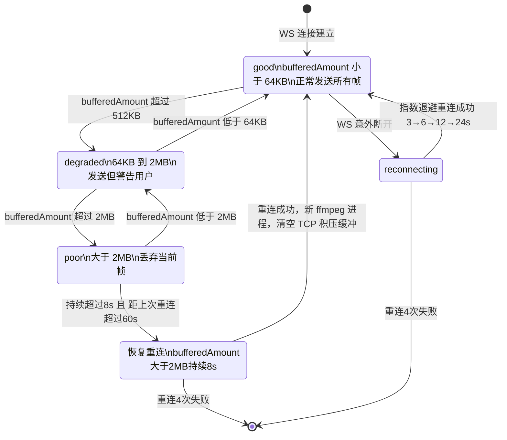
```mermaid
stateDiagram-v2
    [*] --> good: WS 连接建立

    good: good\nbufferedAmount 小于 64KB\n正常发送所有帧
    degraded: degraded\n64KB 到 2MB\n发送但警告用户
    poor: poor\n大于 2MB\n丢弃当前帧
    recovery: 恢复重连\nbufferedAmount大于2MB持续8s

    good --> degraded: bufferedAmount 超过 512KB
    degraded --> good: bufferedAmount 低于 64KB
    degraded --> poor: bufferedAmount 超过 2MB
    poor --> degraded: bufferedAmount 低于 2MB
    poor --> recovery: 持续超过8s 且 距上次重连超过60s

    recovery --> good: 重连成功，新 ffmpeg 进程，清空 TCP 积压缓冲
    recovery --> [*]: 重连4次失败

    good --> reconnecting: WS 意外断开
    reconnecting --> good: 指数退避重连成功 3→6→12→24s
    reconnecting --> [*]: 重连4次失败
```

### 3.3 30 分钟计划重启对比（时序图）

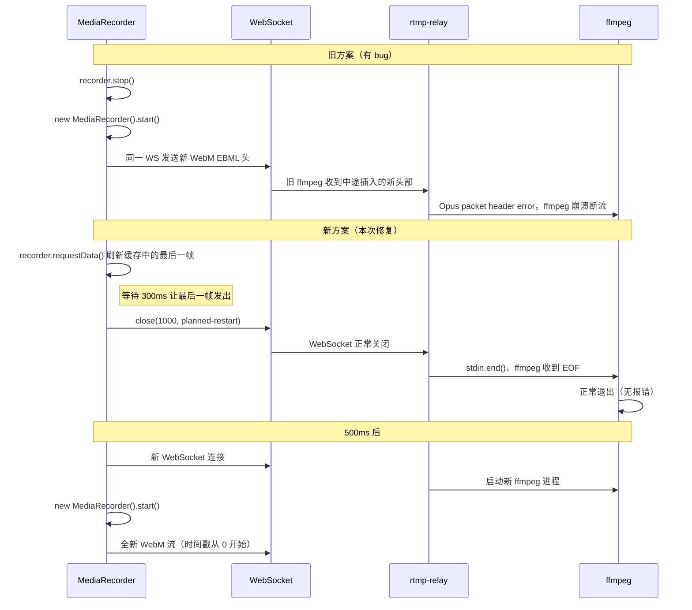
```mermaid
sequenceDiagram
    participant REC as MediaRecorder
    participant WS as WebSocket
    participant RELAY as rtmp-relay
    participant FFMPEG as ffmpeg

    Note over REC,FFMPEG: 旧方案（有 bug）
    REC->>REC: recorder.stop()
    REC->>REC: new MediaRecorder().start()
    REC->>WS: 同一 WS 发送新 WebM EBML 头
    WS->>RELAY: 旧 ffmpeg 收到中途插入的新头部
    RELAY->>FFMPEG: Opus packet header error，ffmpeg 崩溃断流

    Note over REC,FFMPEG: 新方案（本次修复）
    REC->>REC: recorder.requestData() 刷新缓存中的最后一帧
    Note right of REC: 等待 300ms 让最后一帧发出
    REC->>WS: close(1000, planned-restart)
    WS->>RELAY: WebSocket 正常关闭
    RELAY->>FFMPEG: stdin.end()，ffmpeg 收到 EOF
    FFMPEG->>FFMPEG: 正常退出（无报错）
    Note over REC,FFMPEG: 500ms 后
    REC->>WS: 新 WebSocket 连接
    RELAY->>FFMPEG: 启动新 ffmpeg 进程
    REC->>REC: new MediaRecorder().start()
    REC->>WS: 全新 WebM 流（时间戳从 0 开始）
```

---

## 四、两种推流模式对比与已知卡点

### 4.1 模式对比

| 维度 | WHIP（WebRTC） | RTMP（MediaRecorder）|
|------|---------------|----------------------|
| 延迟 | **< 1s** | 3~8s（含 ffmpeg 缓冲） |
| 兼容性 | 现代浏览器均支持 | Chrome / Edge（Safari 不支持） |
| 编码 | 浏览器硬件编码（H.264/VP8） | 浏览器软编 → ffmpeg 转 FLV |
| 服务端复杂度 | 只需 WHIP 接口（SRS/ZLM） | 需额外 rtmp-relay 中转服务 |
| 弱网表现 | ICE 自愈 + 自适应码率 | 背压丢帧 + 重连 |
| 音视频同步 | RTCP NTP 时间戳自动对齐 | WebM muxer 统一时间轴 |
| 国内访问 | STUN 需用国内服务器 | 无限制（仅 HTTP/WS） |

### 4.2 WHIP 推流已知卡点

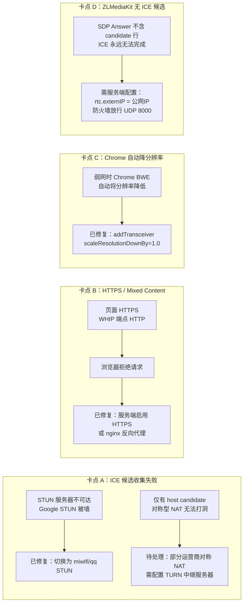
```mermaid
flowchart LR
    subgraph 卡点A["卡点 A：ICE 候选收集失败"]
        A1["STUN 服务器不可达\nGoogle STUN 被墙"]
        A2["仅有 host candidate\n对称型 NAT 无法打洞"]
        A1 --> A3["已修复：切换为 miwifi/qq STUN"]
        A2 --> A4["待处理：部分运营商对称 NAT\n需配置 TURN 中继服务器"]
    end

    subgraph 卡点B["卡点 B：HTTPS / Mixed Content"]
        B1["页面 HTTPS\nWHIP 端点 HTTP"]
        B1 --> B2["浏览器拒绝请求"]
        B2 --> B3["已修复：服务端启用 HTTPS\n或 nginx 反向代理"]
    end

    subgraph 卡点C["卡点 C：Chrome 自动降分辨率"]
        C1["弱网时 Chrome BWE\n自动将分辨率降低"]
        C1 --> C2["已修复：addTransceiver\nscaleResolutionDownBy=1.0"]
    end

    subgraph 卡点D["卡点 D：ZLMediaKit 无 ICE 候选"]
        D1["SDP Answer 不含 candidate 行\nICE 永远无法完成"]
        D1 --> D2["需服务端配置：\nrtc.externIP = 公网IP\n防火墙放行 UDP 8000"]
    end
```

### 4.3 RTMP 推流已知卡点

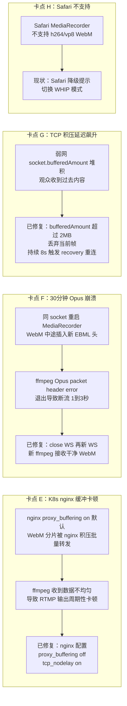
```mermaid
flowchart LR
    subgraph 卡点E["卡点 E：K8s nginx 缓冲卡顿"]
        E1["nginx proxy_buffering on 默认\nWebM 分片被 nginx 积压批量转发"]
        E1 --> E2["ffmpeg 收到数据不均匀\n导致 RTMP 输出周期性卡顿"]
        E2 --> E3["已修复：nginx 配置\nproxy_buffering off\ntcp_nodelay on"]
    end

    subgraph 卡点F["卡点 F：30分钟 Opus 崩溃"]
        F1["同 socket 重启 MediaRecorder\nWebM 中途插入新 EBML 头"]
        F1 --> F2["ffmpeg Opus packet header error\n退出导致断流 1到3秒"]
        F2 --> F3["已修复：close WS 再新 WS\n新 ffmpeg 接收干净 WebM"]
    end

    subgraph 卡点G["卡点 G：TCP 积压延迟飙升"]
        G1["弱网 socket.bufferedAmount 堆积\n观众收到过去内容"]
        G1 --> G2["已修复：bufferedAmount 超过 2MB\n丢弃当前帧\n持续 8s 触发 recovery 重连"]
    end

    subgraph 卡点H["卡点 H：Safari 不支持"]
        H1["Safari MediaRecorder\n不支持 h264/vp8 WebM"]
        H1 --> H2["现状：Safari 降级提示\n切换 WHIP 模式"]
    end
```

---

## 五、待开发功能分析

### 5.1 观看人数（Viewer Count）

**现状**：`roomStore.room.viewerCount` 字段已存在，数据来源尚未对接。

**实现方案：**

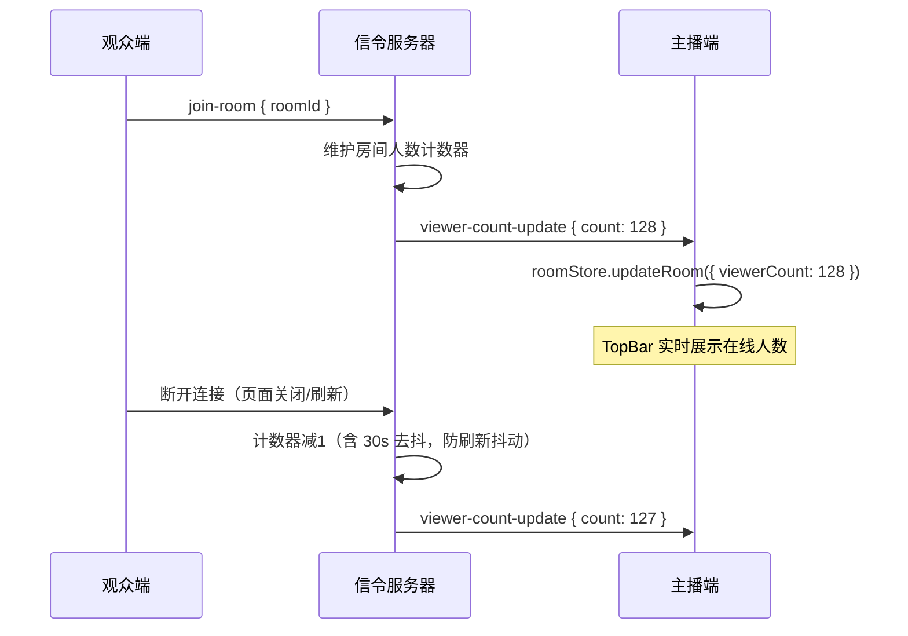
```mermaid
sequenceDiagram
    participant 观众端
    participant 信令服务 as 信令服务器
    participant 主播端

    观众端->>信令服务: join-room { roomId }
    信令服务->>信令服务: 维护房间人数计数器
    信令服务->>主播端: viewer-count-update { count: 128 }
    主播端->>主播端: roomStore.updateRoom({ viewerCount: 128 })
    Note over 主播端: TopBar 实时展示在线人数

    观众端->>信令服务: 断开连接（页面关闭/刷新）
    信令服务->>信令服务: 计数器减1（含 30s 去抖，防刷新抖动）
    信令服务->>主播端: viewer-count-update { count: 127 }
```

**待开发工作：**
- 信令服务端：`join-room` / `leave-room` 事件 + 房间人数维护
- 心跳机制：观众端每 30s 发 `heartbeat`，服务端超时 60s 自动踢出
- 主播端：`SignalService.on('viewer-count-update')` 更新 store

**估时：** 前端 0.5 天 + 服务端 1 天

---

### 5.2 观看地址（Watch URL）

**现状**：`roomStore.room.watchUrl` 字段已存在，未实现复制/分享/二维码。

**实现方案：**

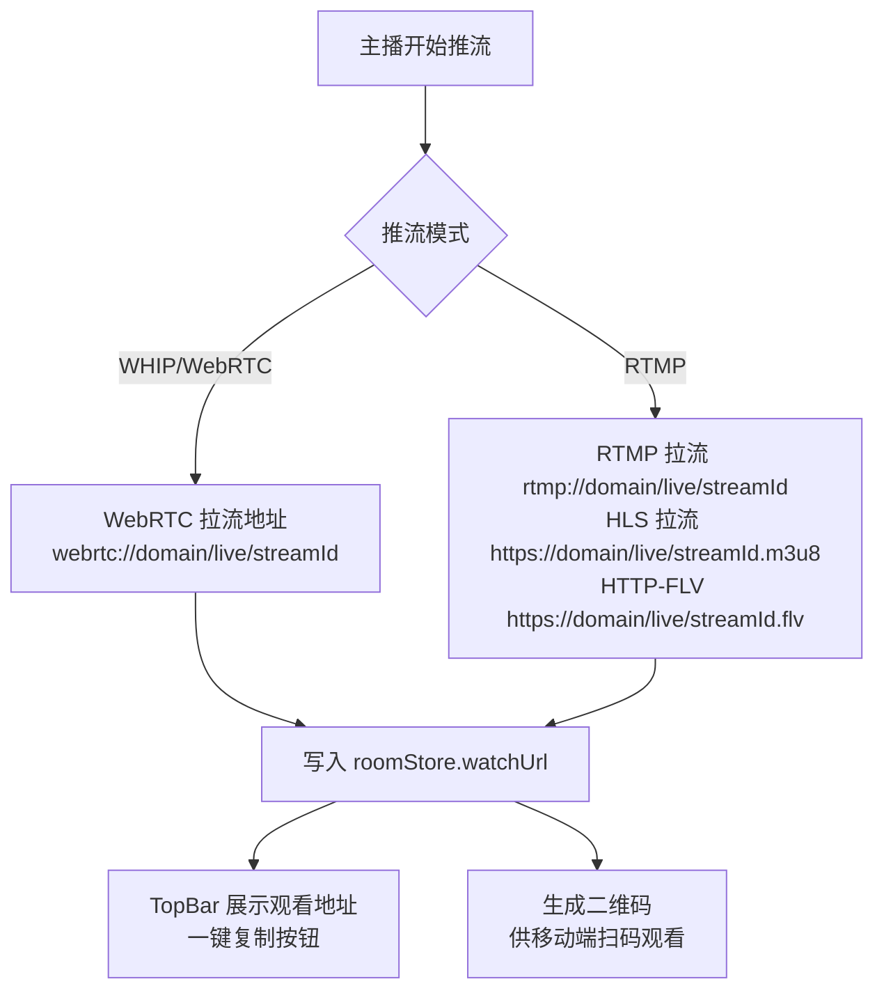
```mermaid
flowchart TD
    A[主播开始推流] --> B{推流模式}

    B -- WHIP/WebRTC --> C["WebRTC 拉流地址\nwebrtc://domain/live/streamId"]
    B -- RTMP --> D["RTMP 拉流 rtmp://domain/live/streamId\nHLS 拉流 https://domain/live/streamId.m3u8\nHTTP-FLV https://domain/live/streamId.flv"]

    C --> E[写入 roomStore.watchUrl]
    D --> E

    E --> F["TopBar 展示观看地址\n一键复制按钮"]
    E --> G["生成二维码\n供移动端扫码观看"]
```

**待开发工作：**
- 根据推流模式和地址规则自动生成对应拉流 URL
- TopBar 添加「复制链接」「生成二维码」按钮
- 支持多协议切换展示（WebRTC / HLS / FLV）

**估时：** 前端 1 天

---

### 5.3 聊天信令（Chat）

**现状**：`chatStore` 消息模型完整，`RightPanel` 聊天骨架已有，**信令收发尚未对接**。

**完整链路时序：**

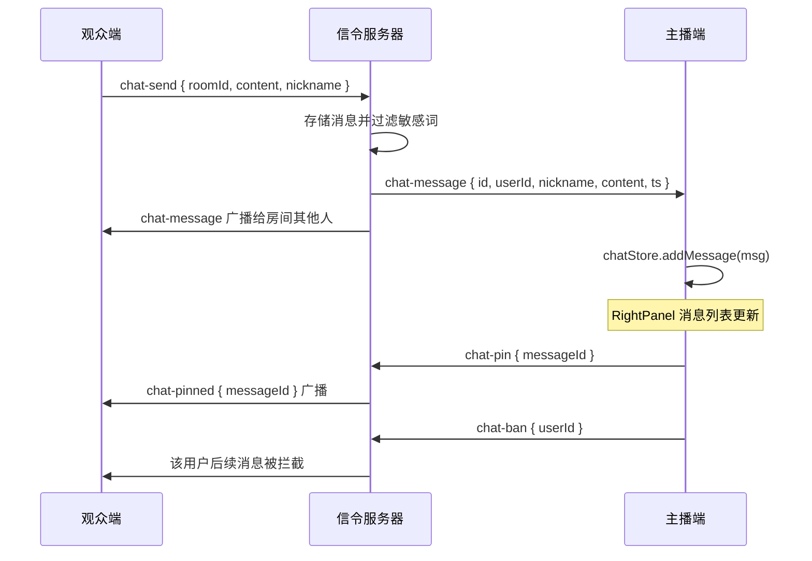
```mermaid
sequenceDiagram
    participant 观众端
    participant 信令服务 as 信令服务器
    participant 主播端

    观众端->>信令服务: chat-send { roomId, content, nickname }
    信令服务->>信令服务: 存储消息并过滤敏感词
    信令服务->>主播端: chat-message { id, userId, nickname, content, ts }
    信令服务->>观众端: chat-message 广播给房间其他人

    主播端->>主播端: chatStore.addMessage(msg)
    Note over 主播端: RightPanel 消息列表更新

    主播端->>信令服务: chat-pin { messageId }
    信令服务->>观众端: chat-pinned { messageId } 广播

    主播端->>信令服务: chat-ban { userId }
    信令服务->>观众端: 该用户后续消息被拦截
```

**待开发工作：**

| 功能 | 优先级 | 估时 |
|------|--------|------|
| 消息收发对接 SignalService | P0 | 0.5 天 |
| 消息发送 UI（输入框 + Emoji） | P0 | 0.5 天 |
| 置顶消息 | P1 | 0.5 天 |
| 敏感词过滤（服务端） | P1 | 1 天 |
| 历史消息回放（加入时拉最近 50 条） | P2 | 1 天 |
| 消息撤回 | P2 | 0.5 天 |

**估时：** 前端 2 天 + 服务端 2 天

---

### 5.4 连麦（Co-Stream）

**现状**：`useCoStream.ts` WebRTC P2P 框架完整，信令处理齐全，**缺服务端信令转发和完整 UI 流程**。

**完整连麦时序（观众申请连麦）：**

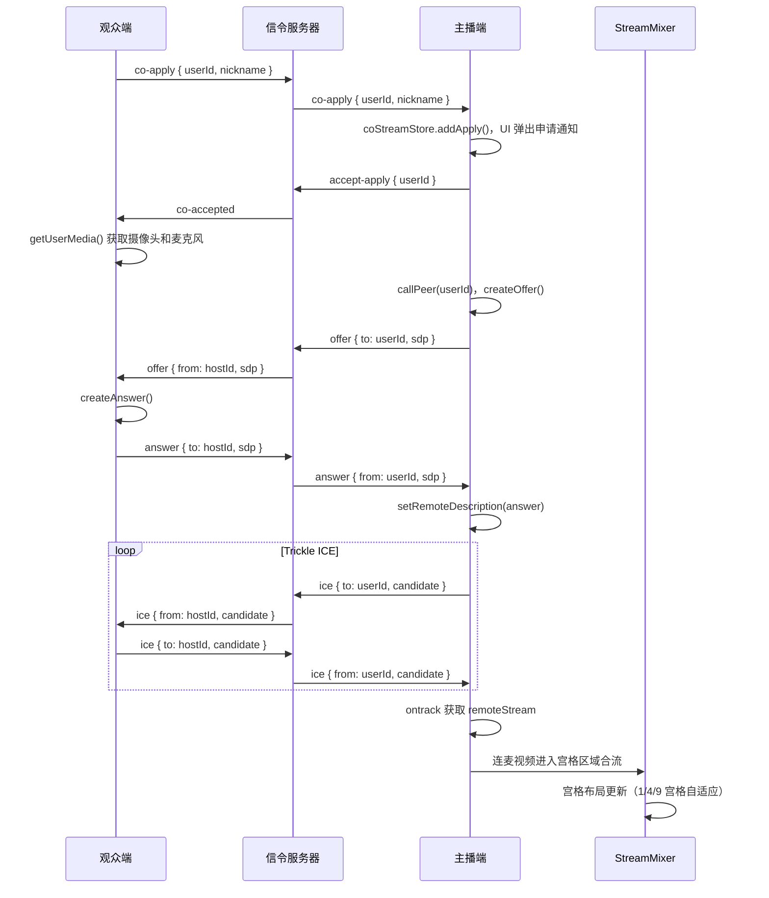
```mermaid
sequenceDiagram
    participant 观众端
    participant 信令服务 as 信令服务器
    participant 主播端
    participant 合流器 as StreamMixer

    观众端->>信令服务: co-apply { userId, nickname }
    信令服务->>主播端: co-apply { userId, nickname }
    主播端->>主播端: coStreamStore.addApply()，UI 弹出申请通知

    主播端->>信令服务: accept-apply { userId }
    信令服务->>观众端: co-accepted

    观众端->>观众端: getUserMedia() 获取摄像头和麦克风
    主播端->>主播端: callPeer(userId)，createOffer()
    主播端->>信令服务: offer { to: userId, sdp }
    信令服务->>观众端: offer { from: hostId, sdp }

    观众端->>观众端: createAnswer()
    观众端->>信令服务: answer { to: hostId, sdp }
    信令服务->>主播端: answer { from: userId, sdp }
    主播端->>主播端: setRemoteDescription(answer)

    loop Trickle ICE
        主播端->>信令服务: ice { to: userId, candidate }
        信令服务->>观众端: ice { from: hostId, candidate }
        观众端->>信令服务: ice { to: hostId, candidate }
        信令服务->>主播端: ice { from: userId, candidate }
    end

    主播端->>主播端: ontrack 获取 remoteStream
    主播端->>合流器: 连麦视频进入宫格区域合流
    合流器->>合流器: 宫格布局更新（1/4/9 宫格自适应）
```

**连麦现状与卡点：**

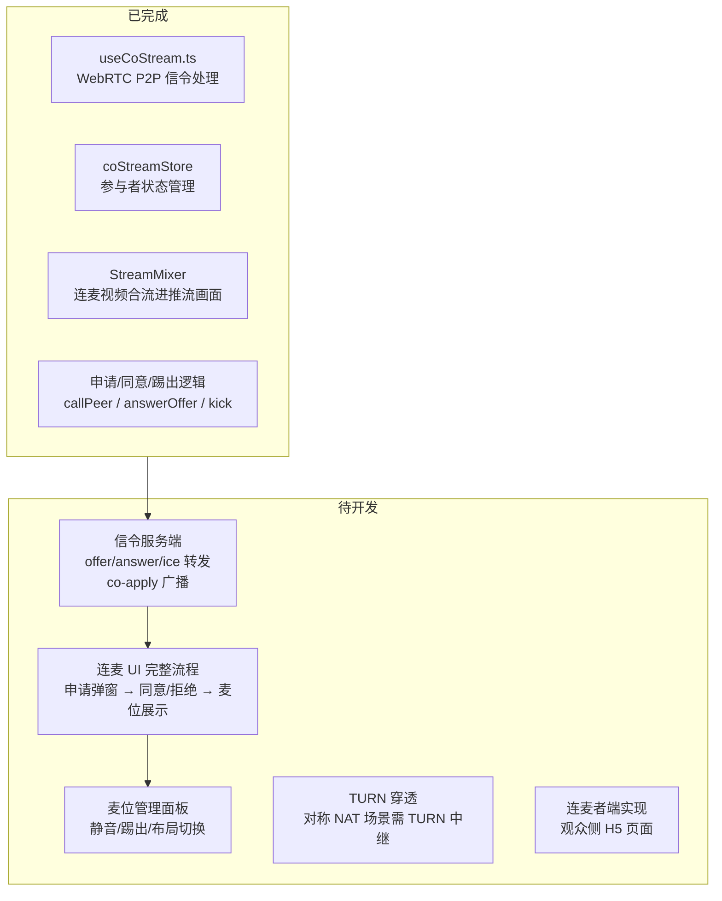
```mermaid
flowchart TD
    subgraph 已完成
        A["useCoStream.ts\nWebRTC P2P 信令处理"]
        B["coStreamStore\n参与者状态管理"]
        C["StreamMixer\n连麦视频合流进推流画面"]
        D["申请/同意/踢出逻辑\ncallPeer / answerOffer / kick"]
    end

    subgraph 待开发
        E["信令服务端\noffer/answer/ice 转发\nco-apply 广播"]
        F["连麦 UI 完整流程\n申请弹窗 → 同意/拒绝 → 麦位展示"]
        G["麦位管理面板\n静音/踢出/布局切换"]
        H["TURN 穿透\n对称 NAT 场景需 TURN 中继"]
        I["连麦者端实现\n观众侧 H5 页面"]
    end

    已完成 --> E
    E --> F
    F --> G
```

**待开发工作：**

| 功能 | 优先级 | 估时 |
|------|--------|------|
| 信令服务端：offer/answer/ice 转发 | P0 | 2 天 |
| 连麦 UI：申请→同意→上麦完整流程 | P0 | 2 天 |
| 麦位管理面板（静音/踢出/布局） | P1 | 1.5 天 |
| useCoStream ICE 换国内 STUN | P1 | 0.5 天 |
| 观众端连麦页面 | P1 | 3 天 |
| TURN 服务器接入 | P2 | 1 天 |

**估时：** 前端 7 天 + 服务端 3 天

---

## 六、整体剩余工作量评估

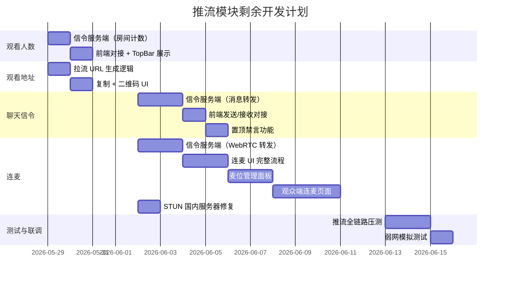
```mermaid
gantt
    title 推流模块剩余开发计划
    dateFormat  YYYY-MM-DD
    section 观看人数
    信令服务端（房间计数）     :a1, 2026-05-29, 1d
    前端对接 + TopBar 展示     :a2, after a1, 1d

    section 观看地址
    拉流 URL 生成逻辑          :b1, 2026-05-29, 1d
    复制 + 二维码 UI           :b2, after b1, 1d

    section 聊天信令
    信令服务端（消息转发）      :c1, 2026-06-02, 2d
    前端发送/接收对接           :c2, after c1, 1d
    置顶禁言功能                :c3, after c2, 1d

    section 连麦
    信令服务端（WebRTC 转发）   :d1, 2026-06-02, 2d
    连麦 UI 完整流程            :d2, after d1, 2d
    麦位管理面板                :d3, after d2, 2d
    观众端连麦页面              :d4, after d3, 3d
    STUN 国内服务器修复         :d5, 2026-06-02, 1d

    section 测试与联调
    推流全链路压测              :e1, 2026-06-13, 2d
    弱网模拟测试                :e2, after e1, 1d
```

---

## 七、本阶段核心技术成果

### 7.1 已解决的关键问题

| 问题 | 根因 | 解决方案 | 状态 |
|------|------|---------|------|
| 摄像头 PiP 占满半个画面 | PiP 用白板 canvas 像素计算，UI 收窄时比例失控 | 改为百分比坐标系，与容器解耦 | ✅ |
| K8s RTMP 周期性卡顿 | nginx `proxy_buffering on` 积压 WebM 分片 | `proxy_buffering off` + `tcp_nodelay on` | ✅ |
| RTMP 30min Opus 崩溃 | 同 socket 重启 recorder，ffmpeg 收到损坏 WebM | 关闭 WS → 新 WS → 新 ffmpeg 进程 | ✅ |
| WHIP 持续重连 | Google STUN 国内不可达 | 切换 miwifi/qq STUN | ✅ |
| Chrome 自动降分辨率 | Chrome BWE 弱网时降分辨率 | `scaleResolutionDownBy: 1.0` | ✅ |
| 本地开发 RTMP 无法连接 | Vite 没有 `/rtmp-relay` 代理 | Vite proxy WebSocket 转发 | ✅ |

### 7.2 本阶段新增能力

- **RTMP 背压控制**：实时感知 TCP 缓冲状态，超阈值丢帧保实时性，持续拥塞自动 recovery 重连
- **WebRTC 自适应码率**：RTCP stats 驱动，无需重连原地调整码率和帧率（good/degraded/poor 三档）
- **ICE 断线自愈**：5s grace period 后才重连，避免 Wi-Fi 切换触发不必要的 SDP 重协商
- **NetQuality 统一状态**：两种推流模式统一的网络质量模型，向 UI 层暴露 `netQuality` ref

---

## 八、风险与依赖

| 风险项 | 影响 | 缓解措施 |
|--------|------|---------|
| 信令服务端未开发 | 聊天、连麦、人数均无法上线 | **优先级最高，建议并行启动** |
| 对称 NAT 穿透 | 部分用户连麦失败（企业网络常见） | 接入 TURN 服务器（coturn） |
| Safari RTMP 不支持 | iOS 用户无法使用 RTMP 模式 | 默认引导 Safari 用户使用 WHIP 模式 |
| ZLMediaKit TURN 配置 | 无 TURN 时对称 NAT 连麦失败 | 提前与服务端确认 rtc.externIP 配置 |
| 多路连麦性能 | 9 路连麦 + 合流 CPU 占用高 | 限制最大连麦路数，4路以上降帧率 |
